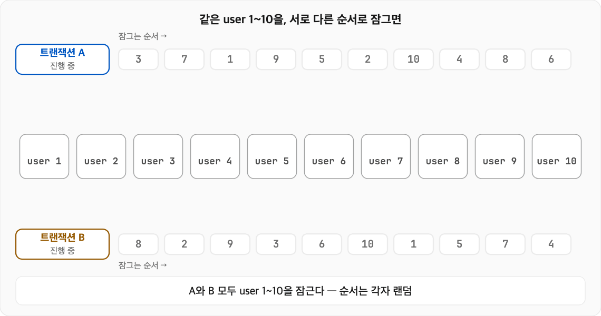
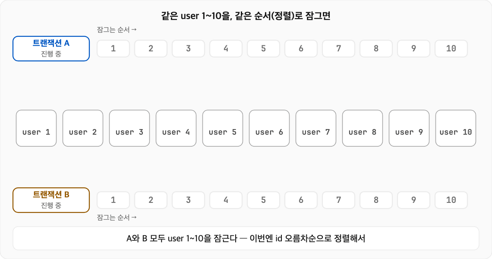
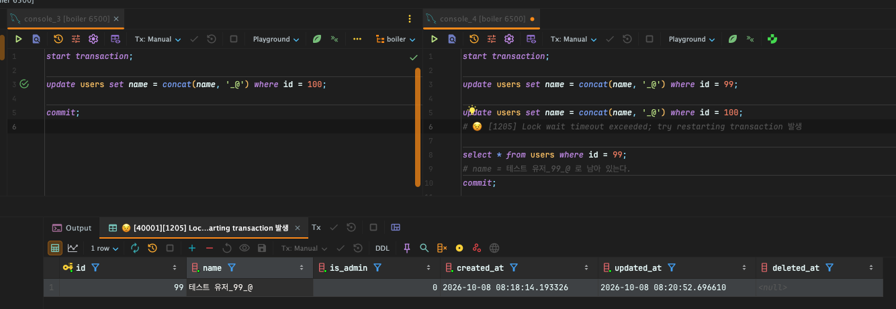
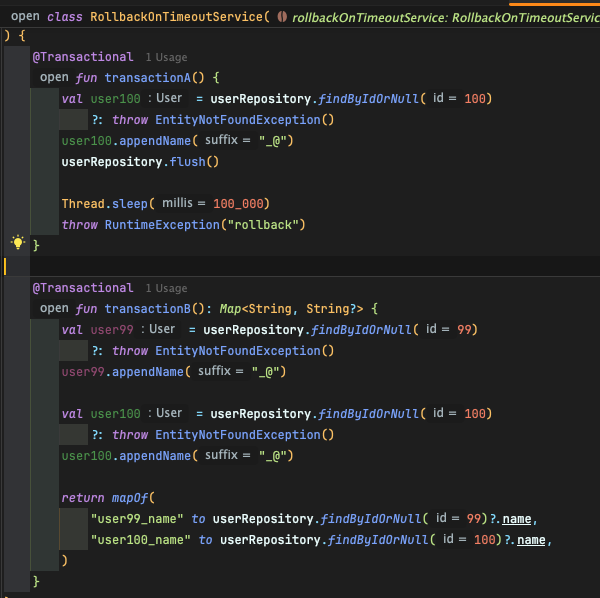

# 락 순서를 맞춰 MySQL 데드락 피하기

업무에서 자주 있는 상황은 아니다 보니 막상 개념은 알고 있어도 로직을 짤 때는 종종 까먹곤 한다. 개발팀에서도 이 개념이 익숙하지 않은 분이 있어서 이번 기회에 글로 정리해 둔다. 이 글을 읽고 비슷한 상황을 만났을 때 소위 우아하게 다룰 수 있으면 좋겠다.

## 설명 기준

- MySQL 8.0 이상
- InnoDB 엔진
- Isolation Level: REPEATABLE READ

## 여러 행을 차례로 잠그는 로직에서는 항상 정렬을 해야 한다

> *When modifying multiple tables within a transaction, or different sets of rows in the same table,*
> *do those operations in a consistent order each time. Then transactions form well-defined queues and do not deadlock.*

MySQL에서는 **UPDATE** 쿼리나 **SELECT ... FOR UPDATE** 쿼리가 **스캔한 행(들)에 레코드 락을 걸어**
**트랜잭션 커밋 전까지는 다른 트랜잭션이 수정/잠금을 못 하도록 한다.** 이 때문에 **여러 행 수정이 필요한 경우 반드시 주의**해야 한다.
(꼭 변경 대상이 아니어도 스캔된 행들은 전부 잠긴다. 애플리케이션 로직은 주로 PK 기준으로 동작해 범위 업데이트가 많지 않지만, 마이그레이션처럼 업데이트 쿼리를 사용할 때에는 반드시 이 점을 주의해야 한다.)

공식 문서에서도 여러 테이블이나 여러 행을 수정할 때 항상 일관된 순서를 권장하며, 그렇게 하면 트랜잭션들이 차례로 줄을 설 뿐 데드락은 발생하지 않는다고 설명한다.

어떠한 상황에서 데드락이 발생하는지 보자.


*데드락 발생*

위 이미지처럼 **각 트랜잭션이 서로 기다리느라 데드락이 발생**한다. 이때 InnoDB는 데드락을 감지해 **한쪽 트랜잭션을 통째로 롤백**한다.

```
ERROR 1213 (40001): Deadlock found when trying to get lock; try restarting transaction
```

> *When deadlock detection is enabled (the default), InnoDB automatically detects transaction deadlocks and rolls back a transaction or transactions to break the deadlock.*
> *InnoDB tries to pick small transactions to roll back, where the size of a transaction is determined by the number of rows inserted, updated, or deleted.*

반대로 **항상 같은 순서로 정렬**을 한다면 아래 경우처럼 정상적으로 동작할 수 있다.
단, 같은 행을 잠그는 로직이 모두 같은 순서를 지켜야 한다. 한 곳이라도 다른 순서로 잠그면 다시 데드락이 날 수 있다.


*데드락 미발생*

**실제 적용 사례**

```kotlin
// 엑셀로 받은 포인트 지급 요청을 userId로 정렬한 뒤 청크로 나눠 발행한다
rows.sortedBy { it.userId }            // userId 오름차순 정렬
    .chunked(CHUNK_SIZE)               // 정렬된 순서 그대로 청크로 나눔
    .forEachIndexed { index, chunk ->
        kafkaProducer.publish(
            topic = POINT_PROCESS_CHUNK,
            key = null,                // 청크는 여러 컨슈머가 동시에 처리한다
            message = PointChunkMessage(requestId, index, chunk),
        )
    }
```

정렬해 두었기 때문에 청크마다 userId 범위가 겹치지 않고, 겹치더라도 모든 컨슈머가 userId 오름차순으로 정렬하여 데드락이 생기지 않는다. 엑셀 원본 순서 그대로 나눴다면 같은 사용자가 여러 청크에 흩어져, 청크마다 다른 순서로 락을 잡을 수 있고 데드락이 발생할 수 있다.

다만 **일관된 순서를 보장한다고 해도 문제가 없는 건 아니다**. 잠긴 행을 기다리는 시간이 innodb_lock_wait_timeout(기본 50초)을 넘기면 아래 오류가 발생한다.

```
ERROR 1205 (HY000): Lock wait timeout exceeded; try restarting transaction
```

이때 롤백되는 건 마지막 문장뿐이고 트랜잭션은 열린 채 남는다. 앞서 잡은 락도 그대로 쥐고 있다
(innodb_rollback_on_timeout 기본값 OFF).



왼쪽 세션이 id=100을 잠근 상태에서, 오른쪽 세션은 id=99를 수정한 뒤 id=100을 기다리다 1205를 받았다.
그런데도 id=99의 변경은 그대로 남아 있다. 이대로 commit하면 id=99만 반영된다.

**데드락과는 달리 InnoDB가 트랜잭션을 정리해 주지는 않는다.** InnoDB 엔진이 어떻게 데이터 변경되는지 생각해보면 이해할 수 있다.
InnoDB는 데이터 변경을 즉시 반영하고 이전 값을 undo log에 남기니 실패한 부분만 골라 롤백할 수 있으니까.

## 실무에서는?

이런 상황을 방지하기 위해서

- 너도? 나도? 나두? 알다시피 당연히 가능한 한 **롱 트랜잭션은 피한다.** 락을 잡고 있는 시간이 길어질 수록 다른 트랜잭션이 오류가 발생하기 쉽다.
- **UPDATE, DELETE 등 잠금이 발생하는 쿼리 사용시 인덱스 타지 않는 WHERE 조건은 사용하지 않는다**. 테이블 전체 행이 잠길수도 있다. 필요한 경우 PK 등을 사용해 범위를 지정하여 작은 범위를 나누어서 진행이 필요하다.
- 트랜잭션을 **일정 청크 단위로 나누어 동작 시키거나 API 등의 외부 통신등은 트랜잭션 안에 포함되지 않도록 해야 한다.**
- 청크로 나누는 경우 **청크 중 부분 실패가 날 수 있기 때문에 이 점을 염두에 두고 설계와 구현**이 되어야 한다.
- 프로젝트에서 **Kafka를 쓰고 있다면 메시지 키로 순서를 보장하는 특성을 이용해 락 충돌을 줄일 수** 있다.
  - 키를 대상 ID로 지정하여 같은 대상의 메시지는 항상 같은 파티션으로 가고, 한 컨슈머 쓰레드가 순서대로 처리한다. 파티션과 컨슈머 스레드를 여러 개로 병렬 구성했을 경우 사용할 수 있는 방법이다.
  - 트래픽이 적은 토픽이라 파티션 1개, 컨슈머 스레드 1개로 구성했다면, 따로 키를 신경 쓰지 않아도 모든 메시지가 순서대로 처리된다.

## 스프링에서는?

*(다소 억지 코드루다가)*



```bash
# Transaction - A
Hibernate: select u1_0.id,u1_0.created_at,u1_0.deleted_at,u1_0.is_admin,u1_0.name,u1_0.updated_at from users u1_0 where u1_0.id=?
Hibernate: update users set deleted_at=?,is_admin=?,name=?,updated_at=? where id=?

# Transaction - B
Hibernate: select u1_0.id,u1_0.created_at,u1_0.deleted_at,u1_0.is_admin,u1_0.name,u1_0.updated_at from users u1_0 where u1_0.id=?
Hibernate: select u1_0.id,u1_0.created_at,u1_0.deleted_at,u1_0.is_admin,u1_0.name,u1_0.updated_at from users u1_0 where u1_0.id=?
Hibernate: update users set deleted_at=?,is_admin=?,name=?,updated_at=? where id=?
Hibernate: update users set deleted_at=?,is_admin=?,name=?,updated_at=? where id=?
```

- A: id=100 UPDATE를 flush하고 100초 동안 sleep
- B: 커밋할 때 UPDATE 99는 성공, UPDATE 100은 A를 기다리다 50초 뒤 1205 CannotAcquireLockException(RuntimeException)이 발생하면서 롤백
- 100초 뒤 A가 RuntimeException("rollback")으로 롤백

```bash
2026-10-08T18:02:23.006+09:00  WARN 22419 --- [boiler] [nio-8080-exec-2] org.hibernate.orm.jdbc.error             : HHH000247: ErrorCode: 1205, SQLState: 40001
2026-10-08T18:02:23.008+09:00  WARN 22419 --- [boiler] [nio-8080-exec-2] org.hibernate.orm.jdbc.error             : Lock wait timeout exceeded; try restarting transaction
2026-10-08T18:02:23.298+09:00 ERROR 22419 --- [boiler] [nio-8080-exec-2] c.r.d.b.c.s.ControllerExceptionHandler   : INTERNAL_SERVER_ERROR occurred

org.springframework.dao.CannotAcquireLockException: could not execute statement [Lock wait timeout exceeded; try restarting transaction] [update users set deleted_at=?,is_admin=?,name=?,updated_at=? where id=?]; SQL [update users set deleted_at=?,is_admin=?,name=?,updated_at=? where id=?]
	...
Caused by: org.hibernate.exception.LockTimeoutException: could not execute statement [Lock wait timeout exceeded; try restarting transaction] [update users set deleted_at=?,is_admin=?,name=?,updated_at=? where id=?]
	...
	at org.springframework.orm.jpa.JpaTransactionManager.doCommit(JpaTransactionManager.java:552) ~[spring-orm-7.0.9.jar:7.0.9]
	... 61 common frames omitted
Caused by: com.mysql.cj.jdbc.exceptions.MySQLTransactionRollbackException: Lock wait timeout exceeded; try restarting transaction
	...
	... 83 common frames omitted

2026-10-08T18:03:08.665+09:00 ERROR 22419 --- [boiler] [nio-8080-exec-1] c.r.d.b.c.s.ControllerExceptionHandler   : INTERNAL_SERVER_ERROR occurred

java.lang.RuntimeException: rollback
	at com.raynor.demo.boiler.service.lab.RollbackOnTimeoutService.transactionA(RollbackOnTimeoutService.kt:26) ~[main/:na]
```

### 오류시 재시도

**@Retryable을 붙인 Facade가 @Transactional 서비스를 호출하도록 빈을 나눴다**. 재시도할 때마다 새 트랜잭션이 열린다.
이 경우뿐만 아니라 **Retryable 어노테이션 사용시 반드시 트랜잭션 바깥에서 해야 한다.** 그렇지 않고 같은 트랜잭션 안에서 다시 시도하면 이미 깨진 트랜잭션을 이어 쓰게 된다.

- 대상은 **CannotAcquireLockException**(1205, 1213)으로 좁힌다.
- 1205 오류는 매번 락을 기다린 뒤에 실패하므로 재시도해도 응답이 오래 걸린다. 상황에 따라서 innodb_lock_wait_timeout를 짧게 잡아도 좋다.

```kotlin
@Service
class RollbackOnTimeoutFacadeService(
    private val rollbackOnTimeoutService: RollbackOnTimeoutService,
) {
    @Retryable(
        includes = [CannotAcquireLockException::class],
        maxRetries = 3,
        delay = 50L,
    )
    fun transactionB(): Map<String, String?> {
        return rollbackOnTimeoutService.transactionB()
    }
}
```

### hibernate 설정

**hibernate.order_updates(기본 false): true** 설정으로 Hibernate가 flush할 때 UPDATE를 엔티티 타입과 PK순으로 정렬 하도록 설정할 수도 있다.

> *Forces Hibernate to order SQL updates by the entity type and the primary key value of the items being updated. This allows for more batching to be used. It will also result in fewer transaction deadlocks in highly concurrent systems. Comes with a performance hit, so benchmark before and after to see if this actually helps or hurts your application.*

다만 공식 문서 내용처럼 성능 저하가 발생할 수 있다고 한다.

## 참고

- https://docs.hibernate.org/stable/orm/userguide/html_single/#batch
- https://dev.mysql.com/doc/refman/8.0/en/innodb-locks-set.html
- https://dev.mysql.com/doc/refman/8.0/en/innodb-deadlock-detection.html
- https://dev.mysql.com/doc/refman/8.0/en/innodb-deadlocks-handling.html
- https://dev.mysql.com/doc/refman/8.0/en/innodb-parameters.html#sysvar_innodb_lock_wait_timeout
- https://dev.mysql.com/doc/refman/8.0/en/innodb-parameters.html#sysvar_innodb_rollback_on_timeout
