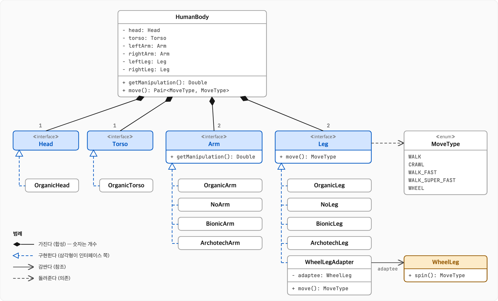
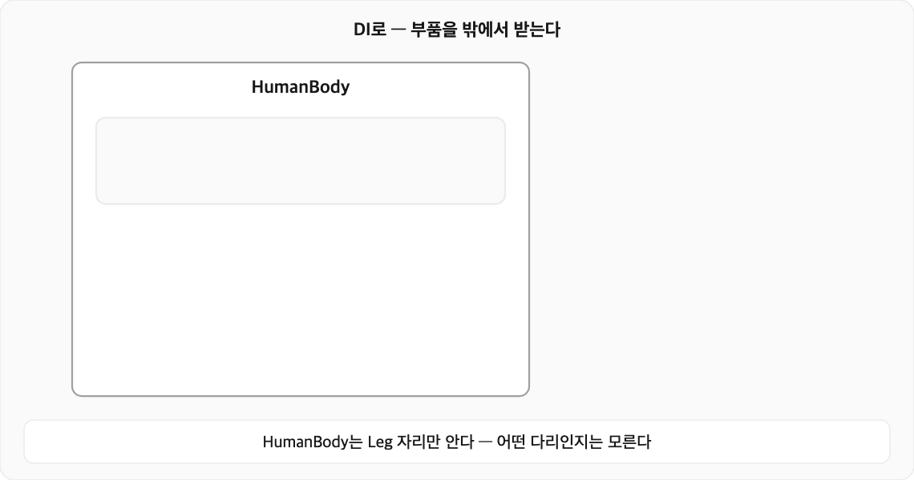
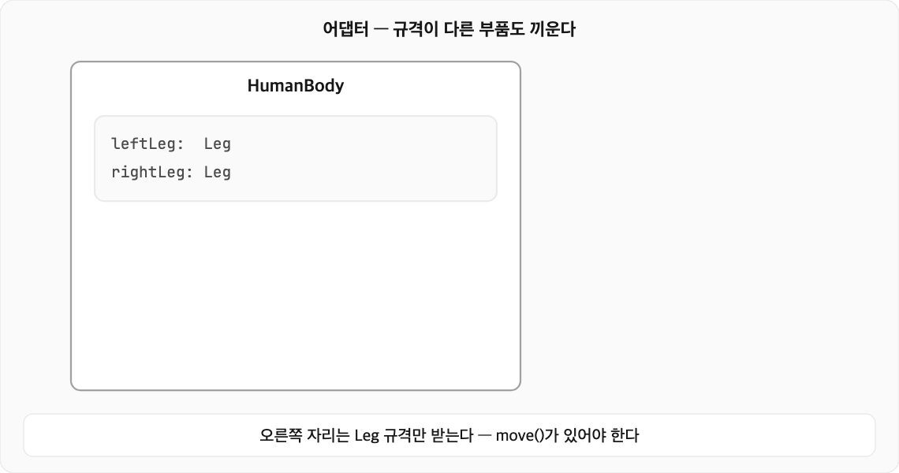

# 의존성 주입(DI, Dependency Injection)과 다형성(Polymorphism)

## 의존성 주입에 대해서
한국어로 의존성 주입을 검색하면 세상천지 스프링 얘기밖에 없다. 의존성 주입을 스프링만의 고유 독점 기능처럼 말하는 사람도 본 적 있을 정도다. 
스프링이 의존성 주입을 잘 활용한 프레임워크인 건 맞지만, 의존성 주입은 특정 프레임워크만의 기능이 아니라 객체지향 특성을 잘 활용한 방식이다.

의존성 주입은 한 문장으로 끝난다. **객체가 필요로 하는 다른 객체를 안에서 직접 만들지 않고 밖에서 받는다.** 생성자 인자 하나 바꾸는 정도의 차이인데, 
이 작은 차이가 다형성과 만나면 코드는 유연해지고 테스트는 짜기 쉬워진다

다만 경험상, 잘 모르는 영역에서 억지로 추상화부터 하면 나중에 후회하기 쉽다. 추상화는 필요해졌을 때 해도 늦지 않다. 정말이다. 나중에 후회할 일을 만들지 않는것것도 실력이다.
AI 덕분에 코드 비용이 낮아진 요즘이라면 더욱 그렇다.

이 글에서는 사람 신체를 예제 삼아 의존성 주입이 왜 좋은지 보여 준다. 
스프링에서 말하는 개념을 앵무새처럼 외우기보다 의존성 주입이 무엇이고 왜 쓰는지를 이해하는 데 도움이 되면 좋겠다.

---

## 예제: 사람 신체

림월드 정착민 신체를 예제로 림월드에서 림(사람 혹은 비슷한 것)은 팔과 다리는 잃거나 제거할 수 있고, 생체공학이나 초월공학 부위로 갈아 끼울 수도 있다. 부위 종류에 따라 팔의 조작 능력과 다리의 이동 방식이 다르다. 



```kotlin
enum class MoveType {
    WALK,
    CRAWL,
    WALK_FAST,
    WALK_SUPER_FAST,
    WHEEL,
}

interface Head

interface Torso

interface Arm {
    fun getManipulation(): Double
}

interface Leg {
    fun move(): MoveType
}

class OrganicHead : Head

class OrganicTorso : Torso

/** 일반 팔 */
class OrganicArm : Arm {
    override fun getManipulation() = 1.0
}

/** 절단된 팔 */
class NoArm : Arm {
    override fun getManipulation() = 0.0
}

/** 생체공학 팔 */
class BionicArm : Arm {
    override fun getManipulation() = 1.25
}

/** 초월공학 팔 */
class ArchotechArm : Arm {
    override fun getManipulation() = 1.5
}

/** 일반 다리 */
class OrganicLeg : Leg {
    override fun move() = MoveType.WALK
}

/** 절단된 다리 */
class NoLeg : Leg {
    override fun move() = MoveType.CRAWL
}

/** 생체공학 다리 */
class BionicLeg : Leg {
    override fun move() = MoveType.WALK_FAST
}

/** 초월공학 다리 */
class ArchotechLeg : Leg {
    override fun move() = MoveType.WALK_SUPER_FAST
}

/** 바퀴 다리 */
class WheelLeg {
    fun spin() = MoveType.WHEEL
}

class WheelLegAdapter(
    private val adaptee: WheelLeg,
) : Leg {
    override fun move() = adaptee.spin()
}

class HumanBody(
    private val head: Head,
    private val torso: Torso,
    private val leftArm: Arm,
    private val rightArm: Arm,
    private val leftLeg: Leg,
    private val rightLeg: Leg,
) {
    fun getManipulation(): Double = leftArm.getManipulation() + rightArm.getManipulation()

    fun move(): Pair<MoveType, MoveType> {
        return Pair(leftLeg.move(), rightLeg.move())
    }
}

fun main() {
    val humanBody = HumanBody(
        head = OrganicHead(),
        torso = OrganicTorso(),
        leftArm = NoArm(),
        rightArm = BionicArm(),
        leftLeg = OrganicLeg(),
        rightLeg = WheelLegAdapter(WheelLeg()),
    )
    humanBody.getManipulation() // 1.25
    humanBody.move() // (WALK, WHEEL)
}
```

이게 완성된 모습이다. 처음부터 이렇게 짜는 건 아니다. 앞에서도 말했지만 내가 정말 잘 알고 있다가 아니라면 섣부른 추상화는 하지마라. 다음 섹션에서는 의존성 주입 없이 출발해 요구사항이 하나씩 들어올 때마다 코드가 어떻게 바뀌는지, 그리고 왜 결국 이 모습에 이르는지 따라간다. 

테스트 코드도 매우 깔끔해진다.
```kotlin
class HumanBodyTest :
    FunSpec(
        {
            afterTest {
                unmockkAll()
            }

            test("일반 림") {
                // given
                val head = OrganicHead()
                val torso = OrganicTorso()
                val leftArm = OrganicArm()
                val rightArm = OrganicArm()
                val leftLeg = OrganicLeg()
                val rightLeg = OrganicLeg()

                // when
                val humanBody = HumanBody(
                    head = head,
                    torso = torso,
                    leftArm = leftArm,
                    rightArm = rightArm,
                    leftLeg = leftLeg,
                    rightLeg = rightLeg,
                )

                // then
                humanBody.getManipulation() shouldBe 2.0
                humanBody.move() shouldBe Pair(MoveType.WALK, MoveType.WALK)
            }

            test("초월 공학 림") {
                // given
                val head = OrganicHead()
                val torso = OrganicTorso()
                val leftArm = ArchotechArm()
                val rightArm = ArchotechArm()
                val leftLeg = ArchotechLeg()
                val rightLeg = ArchotechLeg()

                // when
                val humanBody = HumanBody(
                    head = head,
                    torso = torso,
                    leftArm = leftArm,
                    rightArm = rightArm,
                    leftLeg = leftLeg,
                    rightLeg = rightLeg,
                )

                // then
                humanBody.getManipulation() shouldBe 3.0
                humanBody.move() shouldBe Pair(MoveType.WALK_SUPER_FAST, MoveType.WALK_SUPER_FAST)
            }

            test("바퀴 다리 림") {
                // given
                val head = OrganicHead()
                val torso = OrganicTorso()
                val leftArm = ArchotechArm()
                val rightArm = ArchotechArm()
                val leftLeg = WheelLegAdapter(WheelLeg())
                val rightLeg = WheelLegAdapter(WheelLeg())

                // when
                val humanBody = HumanBody(
                    head = head,
                    torso = torso,
                    leftArm = leftArm,
                    rightArm = rightArm,
                    leftLeg = leftLeg,
                    rightLeg = rightLeg,
                )

                // then
                humanBody.getManipulation() shouldBe 3.0
                humanBody.move() shouldBe Pair(MoveType.WHEEL, MoveType.WHEEL)
            }

            test("mocking 활용") {
                // given
                val head = OrganicHead()
                val torso = OrganicTorso()
                val leftArm = ArchotechArm()
                val rightArm = ArchotechArm()
                val mockLeftLeg = mockk<Leg>()
                val mockRightLeg = mockk<Leg>()

                every { mockLeftLeg.move() } returns MoveType.WALK
                every { mockRightLeg.move() } returns MoveType.CRAWL

                // when
                val humanBody = HumanBody(
                    head = head,
                    torso = torso,
                    leftArm = leftArm,
                    rightArm = rightArm,
                    leftLeg = mockLeftLeg,
                    rightLeg = mockRightLeg,
                )

                // then
                humanBody.getManipulation() shouldBe 3.0
                humanBody.move() shouldBe Pair(MoveType.WALK, MoveType.CRAWL)
            }
        },
    )
```

---

## DI 없이 구현했다면?

### 1단계: 첫 요구사항

처음 요구사항은 "보통 사람"뿐이다. 팔 두 개로 물건을 다루고, 다리 두 개로 걷는다.

```kotlin
class HumanBody {
    fun getManipulation(): Double = 1.0 + 1.0 
    fun move(): Pair<MoveType, MoveType> = Pair(MoveType.WALK, MoveType.WALK)
}
```

요구사항이 이것뿐이라면 이 코드가 정답이다. 여기서 굳이 `Arm`, `Leg` 인터페이스부터 만들고 구현체를 나누는 건 올지 안올지 모르는 미래를 위해 지금 비용을 태우지 마라. KISS(Keep It Simple, Stupid), YAGNI(You Aren't Gonna Need It) 원칙대로 실무에서 필요 없는 추상화는 하지 않는다. 추상화는 요구사항이 실제로 왔을 때 현 시점에 필요한지 판단하여 진행 한다.

### 2단계: 추가 요구사항
추가 요구사항이 들어온다. 팔다리를 잃었거나, 생체공학 의수,의족을 단 사람, 초월공학 부위를 단 사람도 다룰수 있어야 한다.
간단하고 구현하기 쉬운 방향으로 신체 부위 종류를 enum으로 받고, 메서드 안에서 종류마다 분기한다.

```kotlin
enum class ArmType { ORGANIC, NONE, BIONIC, ARCHOTECH }
enum class LegType { ORGANIC, NONE, BIONIC, ARCHOTECH }

class HumanBody(
    private val leftArmType: ArmType,
    private val rightArmType: ArmType,
    private val leftLegType: LegType,
    private val rightLegType: LegType,
) {
    fun getManipulation(): Double = manipulationOf(leftArmType) + manipulationOf(rightArmType)

    fun move(): Pair<MoveType, MoveType> = Pair(moveOf(leftLegType), moveOf(rightLegType))

    private fun manipulationOf(type: ArmType): Double =
        when (type) {
            ArmType.ORGANIC -> 1.0
            ArmType.NONE -> 0.0
            ArmType.BIONIC -> 1.25
            ArmType.ARCHOTECH -> 1.5
        }

    private fun moveOf(type: LegType): MoveType =
        when (type) {
            LegType.ORGANIC -> MoveType.WALK
            LegType.NONE -> MoveType.CRAWL
            LegType.BIONIC -> MoveType.WALK_FAST
            LegType.ARCHOTECH -> MoveType.WALK_SUPER_FAST
        }
}
```

얼핏 보면 깔끔하다. 문제는 코드가 지저분하다는 게 아니라 **HumanBody가 바뀌어야 할 이유가 너무 많다**는 데 있다.
HumanBody는 신체부위를 조합하는 클래스인데, 정작 각 부위의 사정들까지 전부 알고 있다.

- 생체공학 팔의 조작 능력을 1.25에서 1.3으로 조정해도 HumanBody를 고친다.
- 신규 다리 종류가 하나 추가돼도 HumanBody를 고친다.
- 부위마다 행동이 하나 늘면(부위별 무게나 가격 같은), 같은 enum을 도는 `when`이 하나 더 생긴다. 신규 부위를 추가할 때 고칠 곳도 그만큼 늘어난다.

### 3단계: VOC 추가 요구사항
이번에는 VOC가 접수됐다. 다리에 바퀴를 달았는데 우리 시스템에서는 바퀴 다리를 고를 수 없다는 불만이고 빠른 시일 내에 고치지 않으면 소비자원에 신고하겠다고 한다.
바퀴 다리를 처음부터 만들 시간은 없다. 마침 바퀴 다리 라이브러리가 있어서 그걸 가져다 쓰기로 한다.
남이 만든 라이브러리라 메서드 이름도 `move()`가 아니라 `spin()`이고, 우리가 고칠 수도 없다.

```kotlin
class WheelLeg {
    fun spin(): MoveType = MoveType.WHEEL
}
```

2단계 구조에 이걸 넣으려면 HumanBody 안에서 직접 만들어 부르는 수밖에 없다.

```kotlin
enum class LegType { ORGANIC, NONE, BIONIC, ARCHOTECH, WHEEL }

class HumanBody(
    // ...
) {
    // ...

    private fun moveOf(type: LegType): MoveType =
        when (type) {
            LegType.ORGANIC -> MoveType.WALK
            LegType.NONE -> MoveType.CRAWL
            LegType.BIONIC -> MoveType.WALK_FAST
            LegType.ARCHOTECH -> MoveType.WALK_SUPER_FAST
            LegType.WHEEL -> WheelLeg().spin() // MoveType.WHEEL을 바로 돌려줘도 되지만, 예제라서 라이브러리를 부르는 형태로 썼다
        }
}
```

- **어댑터를 쓸 수 없다.** 어댑터는 외부 규격을 우리 규격에 맞추는 패턴이라, 맞출 규격이 있어야 쓸 수 있다. 2단계 구조에는 그 규격(인터페이스)이 없다. 그래서 외부 클래스가 HumanBody 안으로 직접 들어온다.
- **HumanBody가 외부 라이브러리에 묶인다.** 라이브러리가 `spin()`을 `rotate()`로 바꾸거나 다른 라이브러리로 갈아타면 HumanBody를 고쳐야 한다. 몸을 조합하는 클래스가 외부 라이브러리의 사정까지 떠안는다.
- **테스트가 어려워진다.** 바퀴 다리가 실제 장비나 외부 시스템과 통신한다면 테스트에서는 가짜로 바꿔야 한다. 그런데 HumanBody가 안에서 `WheelLeg()`를 만드니 private 함수를 stub하거나 생성자를 가로채는 식으로, 클래스 내부 구현에 기대는 방법밖에 없다.

```kotlin
class BodyWithoutDiTest :
    FunSpec(
        {
            afterTest { unmockkAll() }

            test("바퀴 다리를 흉내 내려면 private 함수를 stub 해야 한다") {
                // given, 코드 억지로 온몸 비튼 점 양해 바람
                val humanBody = spyk(
                    HumanBody(
                        leftArmType = ArmType.ORGANIC,
                        rightArmType = ArmType.ORGANIC,
                        leftLegType = LegType.ORGANIC,
                        rightLegType = LegType.ORGANIC,
                    ),
                    recordPrivateCalls = true,
                )

                // when
                every { humanBody["moveOf"](any<LegType>()) } returns MoveType.WHEEL

                // then
                humanBody.getManipulation() shouldBe 2.0
                humanBody.move() shouldBe Pair(MoveType.WHEEL, MoveType.WHEEL)

                verify(exactly = 2) {
                    humanBody["moveOf"](any<LegType>())
                }
            }

            test("바퀴 다리를 흉내 내려면 생성자를 가로채야 한다") {
                // given
                mockkConstructor(WheelLeg::class)
                every { anyConstructed<WheelLeg>().spin() } returns MoveType.CRAWL

                // when
                val humanBody = HumanBody(
                    leftArmType = ArmType.ORGANIC,
                    rightArmType = ArmType.ORGANIC,
                    leftLegType = LegType.WHEEL,
                    rightLegType = LegType.WHEEL,
                )

                // then
                humanBody.getManipulation() shouldBe 2.0
                humanBody.move() shouldBe Pair(MoveType.CRAWL, MoveType.CRAWL)

                verify(exactly = 2) {
                    anyConstructed<WheelLeg>().spin()
                }
            }
        },
    )
```


---

## DI로 구현하면

3단계의 문제는 두 가지로 모인다. 바퀴 다리를 끼울 **규격**이 없다는 것, 그리고 HumanBody가 부위를 **직접 만든다**는 것이다. 그래서 두 가지를 한다. 
규격(`Arm`, `Leg` 인터페이스)을 만들고, 부위는 HumanBody 밖에서 만들어 생성자로 넘긴다. 앞에서 본 예제 코드가 그 결과다.

둘 중 하나만 해서는 소용없다. 인터페이스를 만들어도 HumanBody 안에서 `OrganicLeg()`를 직접 만들면, 새 다리가 생길 때마다 여전히 HumanBody를 고쳐야 한다. 다형성은 갈아 끼울 부품을 만들고, 의존성 주입은 갈아 끼울 자리를 만든다.



### 다형성: 신체 부위를 부품처럼 교체할 수 있음

HumanBody가 아는 건 `Leg`가 `move()`를 할 수 있다는 것뿐이다. 어떤 다리인지는 모른다. 그래서 어떤 다리를 끼워도 HumanBody 코드는 그대로다.

```kotlin
val crawler = HumanBody(
    head = OrganicHead(),
    torso = OrganicTorso(),
    leftArm = OrganicArm(),
    rightArm = OrganicArm(),
    leftLeg = NoLeg(),
    rightLeg = NoLeg(),
)
val runner = HumanBody(
    head = OrganicHead(),
    torso = OrganicTorso(),
    leftArm = OrganicArm(),
    rightArm = OrganicArm(),
    leftLeg = BionicLeg(),
    rightLeg = ArchotechLeg(),
)

crawler.move() // (CRAWL, CRAWL)
runner.move()  // (WALK_FAST, WALK_SUPER_FAST)
```

2단계와 비교하면 차이가 분명하다. 생체공학 팔의 조작 능력을 바꾸면 `BionicArm`만 고친다. 새 다리가 생기면 `Leg`를 구현한 클래스를 하나 추가한다. 어느 쪽이든 HumanBody는 손대지 않는다.

### 어댑터: 규격이 다른 바퀴 다리도 끼울 수 있음



이제 `Leg`라는 규격이 생겼으니 어댑터를 쓸 수 있다. `WheelLeg`는 고칠 수 없지만, `WheelLeg`를 감싸서 `Leg` 규격에 맞추는 클래스는 우리가 만들 수 있다.

```kotlin
class WheelLegAdapter(
    private val adaptee: WheelLeg,
) : Leg {
    override fun move() = adaptee.spin()
}
```

`spin()`을 아는 곳은 이 어댑터 한 곳뿐이다. 라이브러리가 메서드 이름을 바꾸면 어댑터만 고치면 된다. 조립하는 쪽에서 `WheelLegAdapter(WheelLeg())`를 넘기기만 하면 되고, HumanBody는 바퀴 다리가 있다는 사실조차 모른다.

어댑터가 외부 라이브러리에만 쓰이는 건 아니다. 우리 코드라도 이미 여러 곳에서 쓰고 있어 고치기 부담스러운 클래스나, 규격이 생기기 전에 만들어진 클래스를 새 규격에 맞출 때도 같은 방식으로 감싼다.

---

## 지켜지는 소프트웨어 원칙

### Single Responsibility Principle: 단일 책임 원칙
이 원칙을 클린 아키텍쳐에서도 사람들이 오해한다고 적어놓을 정도로 "클래스는 한 가지 일만 해야 한다"로 오해하는 경우가 많은데, 
로버트 마틴의 정의는 "클래스를 변경할 이유는 하나뿐이어야 한다"이다. HumanBody는 신체 부위를 조합하는 규칙이 바뀔 때만 바뀐다. 
새 다리가 추가되거나 팔의 조작 능력 수치가 바뀌어도 HumanBody는 그대로다. 부위를 고르고 만드는 일은 HumanBody 밖에서 하기 때문이다.

### Open/Closed Principle: 개방-폐쇄 원칙
확장에는 열려 있고 수정에는 닫혀 있어야 한다. 초월공학 다리나 바퀴 다리를 새로 만들어도 HumanBody는 한 줄도 고치지 않는다. 
새 클래스를 추가하는 것만으로 기능이 늘어난다.

### Liskov Substitution Principle: 리스코프 치환 원칙
HumanBody는 어떤 Leg가 들어와도 똑같이 동작한다. 다리가 없는 NoLeg도 예외를 던지는 대신 CRAWL을 돌려주기 때문에, 
HumanBody는 다리가 없는 경우를 따로 신경 쓰지 않는다.

### Interface Segregation Principle: 인터페이스 분리 원칙
신체 부위마다 역할에 맞는 작은 인터페이스를 둔다. 팔과 다리를 BodyPart 하나로 묶었다면 Arm도 쓰지 않는 move()까지 구현해야 한다.
```kotlin
interface BodyPart {
    fun move(): MoveType
    fun getManipulation(): Double
}
```

### Dependency Inversion Principle: 의존성 역전 원칙
HumanBody는 OrganicLeg 같은 구체 클래스가 아니라 Leg 인터페이스에 의존한다. 어떤 구현을 쓸지는 HumanBody를 만드는 쪽이 정한다. 
의존성 주입은 이 원칙을 코드로 옮기는 가장 흔한 방법이다.


## 테스트가 쉬워진다.

"바퀴 다리가 고장 난 상황" 검증 목적으로 테스트 코드를 작성한다고 했을 때 두 방식으로 비교하면 차이가 분명하다.

```kotlin
// DI 없이: 클래스 내부를 가로챈다
mockkConstructor(WheelLeg::class)
every { anyConstructed<WheelLeg>().spin() } returns MoveType.CRAWL

// DI로: 가짜를 생성자로 넘긴다
val brokenWheel = mockk<Leg>()
every { brokenWheel.move() } returns MoveType.CRAWL
```

예제라서 별 차이 없다고 느낄 수 있지만, 실무에서는 가로채야 할 의존성이 하나둘 늘면서 테스트 코드가 금방 지저분해지고 복잡해진다.

